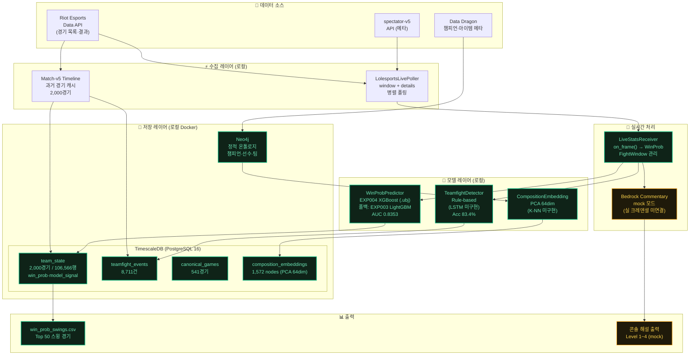
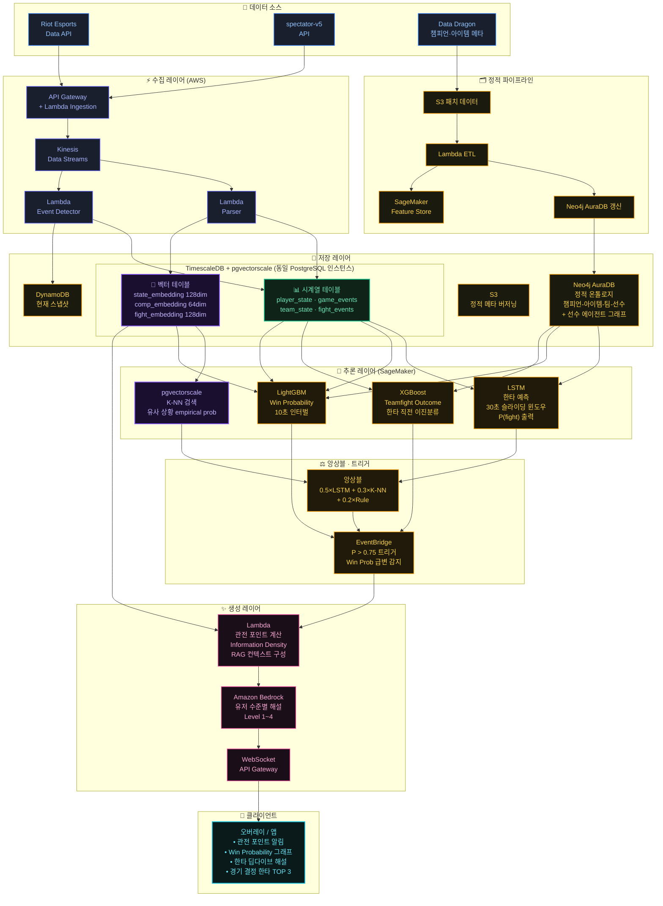
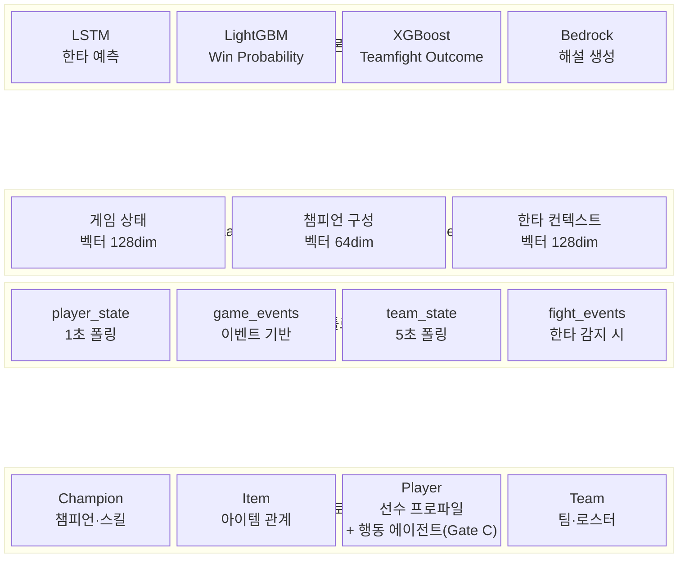
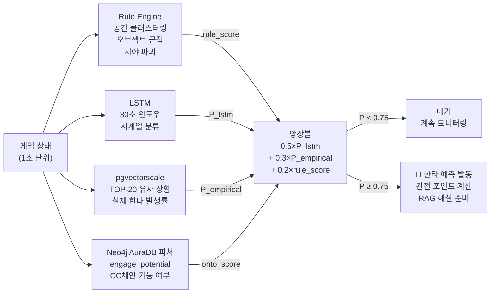
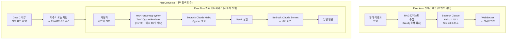
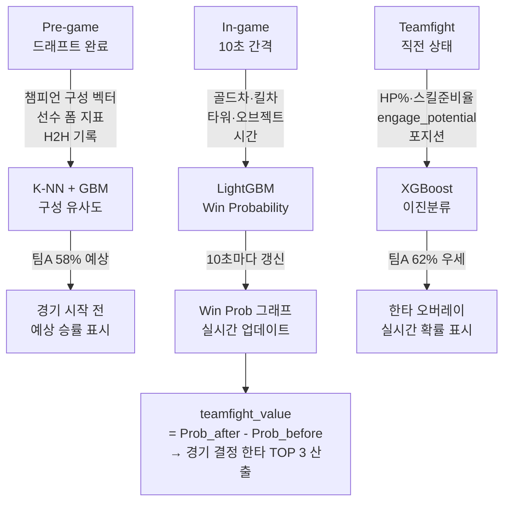

# 아키텍처 다이어그램 (Mermaid)

> 인터랙티브 HTML 버전: [[architecture-diagram]]
> 기술 상세: [[_index]]
>
> **문서 구성**: §1 현재 구현 (로컬 프로토타입, Gate A 완료) → §2 목표 아키텍처 (AWS 프로덕션) → §3-5 세부 흐름

---

## 1. 현재 구현 아키텍처 (로컬 프로토타입 · 2026-04-30)

> Gate A 완료 기준. AWS 인프라 없이 로컬에서 전체 파이프라인 검증 완료.

**범례**: 🟢 구현 완료 · 🟡 mock 모드 · ⚫ 미구현

---

## 2. 목표 아키텍처 (클라우드 프로덕션 · 미래 상태)

> **주의**: 이 다이어그램은 Gate D 이후 클라우드 프로덕션 목표 상태. 현재 로컬 프로토타입 현황은 §1 참조.
> LSTM·K-NN·DynamoDB·Kinesis·SageMaker는 Gate B/C 이후 구현 예정.
> **그래프 DB**: Amazon Neptune 아님 → **Neo4j AuraDB** (Bolt 호환, 코드 변경 없이 이전 가능, GDS 알고리즘 지원)

---

## 3. 온톨로지 레이어 구조

---

## 4. 한타 예측 앙상블 흐름

---

## 5. 서비스 흐름 분리 — Flow A vs Flow B

> Gate C부터 두 흐름이 병렬로 운영됩니다.

**핵심 결정:**
- NeoConverse는 프로덕션 서비스에 사용하지 않음 (Labs 실험 프로젝트)
- Flow B 프로덕션 구현: `neo4j-graphrag-python` + Bedrock 커스텀 래퍼
- 팀 구현 부담: 도메인 예시 10개 + 래퍼 ~60줄

---

## 7. 승부 예측 3단계 흐름

---

## 연결 문서

- [[_index]] — 기술 아키텍처 전체 (온톨로지 레이어 · DB 설계 · SQL)
- [[service-scenario]] — 서비스 구조 · 유저 여정 · 기능 매핑
- [[architecture-diagram]] — 인터랙티브 HTML 다이어그램
